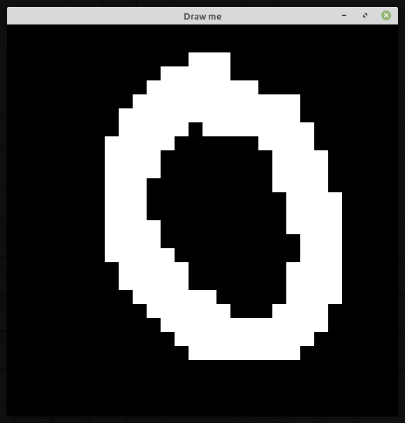
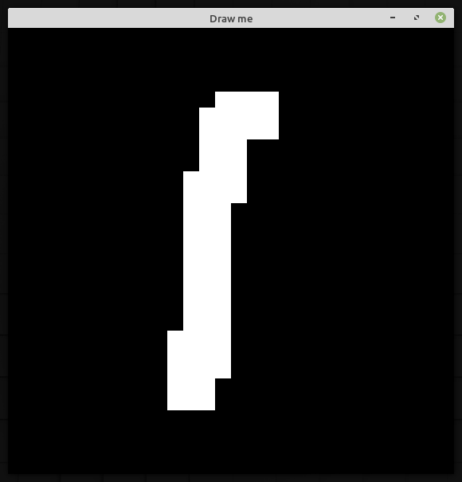
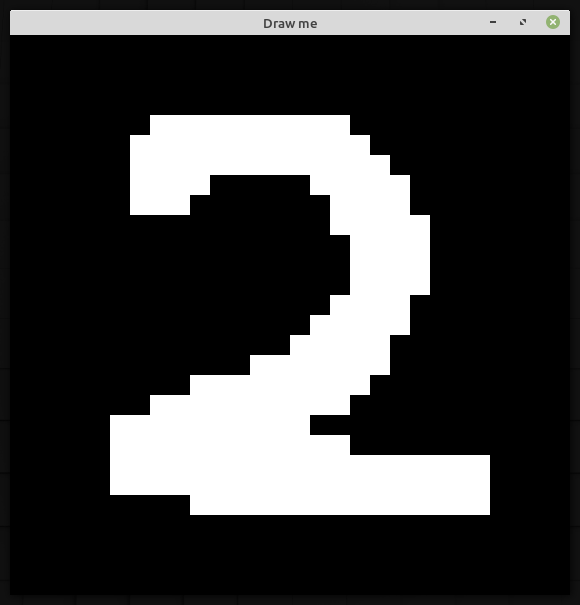
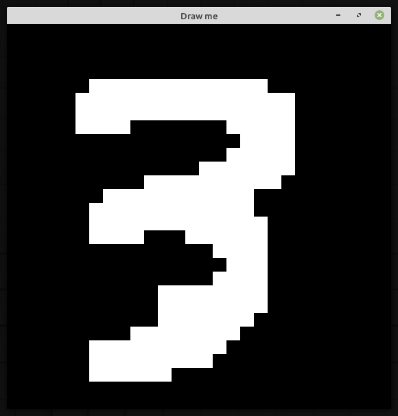
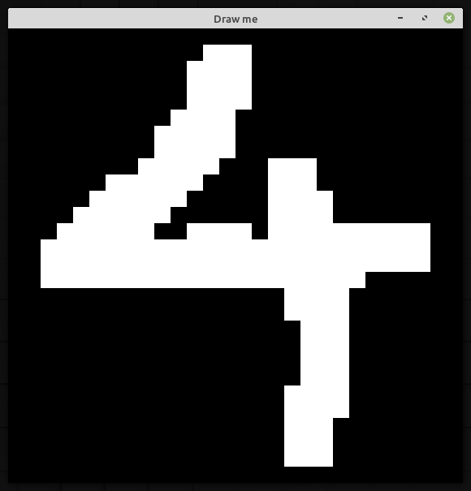
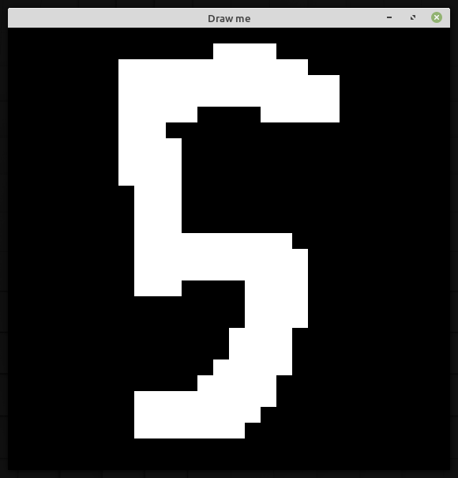
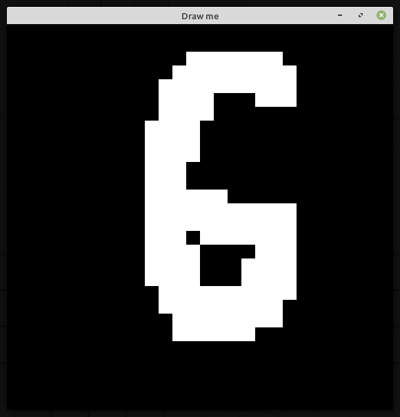
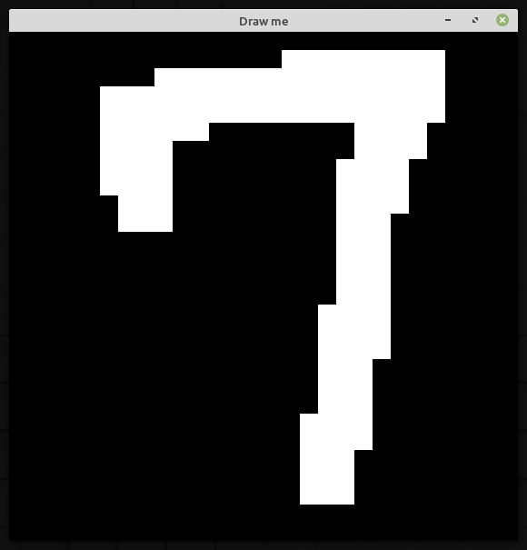
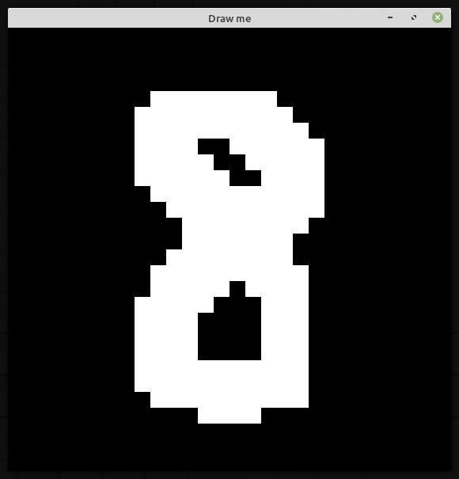
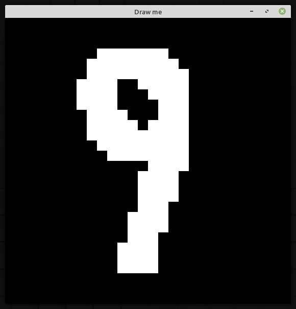

# ConvNet
GEMM(GEneral Matrix Multiplication)アルゴリズムを使用した、Convolutional Neural Networkデモ

#### 特徴
* C++を使用して実装
* 32bit Intel® Core™ i5-2400 CPU @ 3.10GHz ×4,Debian GNU/Linux 11 (bullseye)でのみ動作確認済み
* 最適化が完璧でないため、学習速度は"著しく"遅い(GPU或いはAI acceleratorの使用に不対応)
* ほぼスクラッチから実装。(線形代数ライブラリーEigen3を使用しているためフルスクラッチではない)

#### 必要な外部ライブラリー
* Eigen3 
* SFML   (描写アプリに必要)
* gtest  (ユニットテストに必要)
* (JSONライブラリ) https://github.com/nlohmann/json

#### 以下２つの外部ライブラリは、/thirdpartyディレクトリ下にある
* (MNISTリーダー)     https://github.com/wichtounet/mnist/
* (CIFAR10リーダー)   https://github.com/wichtounet/cifar-10 (元のコードだとディレクトリが固定なので、コードを少し変更している)

### MNIST学習(コードの一部を表示。詳細は、/examples/mnist_demo.cpp)
```cpp
 
  int training_data_size;
  const int data_size = 60000;
  const int test_data_size = 10000;
  
  // 外部ライブラリーを使用して、MNISTデータセットを読み込み。
  auto dataset = mnist::read_dataset<std::vector, std::vector, uint8_t, uint8_t>("../mnist");
  
  // データセットの型を定義。
  std::vector<Eigen::MatrixXf> data;
  std::vector<Eigen::MatrixXf> labels;
  std::vector<Eigen::MatrixXf> training_data;
  std::vector<Eigen::MatrixXf> training_labels;
  std::vector<Eigen::MatrixXf> validation_data;
  std::vector<Eigen::MatrixXf> validation_labels;
  std::vector<Eigen::MatrixXf> test_data;
  std::vector<Eigen::MatrixXf> test_labels;
  
  PreprocessTrainingData(dataset,data,labels,data_size);            // data,labelsにトレーニングデータを格納
  PreprocessTestData(dataset,test_data,test_labels,test_data_size); // test_data,test_labelsにテストデータを格納
  // dataをtraining_dataとvalidation_dataに,それぞれ全体の90%,10%の割合で分割。labelsも同様。
  training_data_size = SplitDataset(data,labels,training_data,training_labels,validation_data,validation_labels,0.9);
    
  // インプットサイズ{28,28,1}(={height,width,depth})
  // OptimizerとしてAdamWを使用(minibatchサイズ32,learning rateを1e-4,weight decayパラメータを1e-1,Loss関数としてCategoricalCrossEntropyを使用)
  Network network({28,28,1},new optimizers::AdamW(training_data_size,32,1e-4,1e-1),Losses::CategoricalCrossEntropy);
  
  // アーキテクチャを定義
  network.addConv({5,5,6},{1,1},{2,2},Activations::LeakyRelu);  
  network.addPooling({2,2},{2,2});
  network.addConv({5,5,16},{1,1},{0,0},Activations::LeakyRelu);
  network.addPooling({2,2},{2,2});
  network.addDense(120,Activations::LeakyRelu);
  network.addDense(84,Activations::LeakyRelu);
  network.addDense(10);
  
  TrainNetwork(network,training_data,training_labels,validation_data,validation_labels,30); // 学習(epoch=30)
  MeasureTestAccuracy(network,test_data,test_labels); // テストデータを使用して精度測定

```

#### 上記を実行後のターミナルを表示
```console
$time ./mnist_demo

データセットを以下の割合で分割しました:
(Training dataset size:54000,Validation dataset size:6000)

[Epoch:1]
Progress:100.000000
Training Accuracy:95.2185%
Training loss:0.159512

Validation Accuracy:95.1833%
Validation loss:0.16031

[Epoch:2]
Progress:100.000000
Training Accuracy:96.3944%
Training loss:0.118527

Validation Accuracy:96.1167%
Validation loss:0.124891

[Epoch:3]
Progress:100.000000
Training Accuracy:96.9963%
Training loss:0.0967849

Validation Accuracy:96.7333%
Validation loss:0.106975

[Epoch:4]
Progress:100.000000
Training Accuracy:97.4907%
Training loss:0.0802523

Validation Accuracy:97.1833%
Validation loss:0.0930062

[Epoch:5]
Progress:100.000000
Training Accuracy:97.8018%
Training loss:0.0704676

Validation Accuracy:97.3667%
Validation loss:0.0851653

[Epoch:6]
Progress:100.000000
Training Accuracy:98.0796%
Training loss:0.0617308

Validation Accuracy:97.4833%
Validation loss:0.077688

[Epoch:7]
Progress:100.000000
Training Accuracy:98.2778%
Training loss:0.0550412

Validation Accuracy:97.7%
Validation loss:0.072566

[Epoch:8]
Progress:100.000000
Training Accuracy:98.4685%
Training loss:0.0501393

Validation Accuracy:97.8167%
Validation loss:0.0688145

[Epoch:9]
Progress:100.000000
Training Accuracy:98.5889%
Training loss:0.0465129

Validation Accuracy:97.9%
Validation loss:0.0660232

[Epoch:10]
Progress:100.000000
Training Accuracy:98.7%
Training loss:0.0434001

Validation Accuracy:97.9667%
Validation loss:0.0640782

[Epoch:11]
Progress:100.000000
Training Accuracy:98.8%
Training loss:0.0399863

Validation Accuracy:97.9833%
Validation loss:0.0613052

[Epoch:12]
Progress:100.000000
Training Accuracy:98.8463%
Training loss:0.0379964

Validation Accuracy:98%
Validation loss:0.0600557

[Epoch:13]
Progress:100.000000
Training Accuracy:98.9111%
Training loss:0.0362731

Validation Accuracy:98.0333%
Validation loss:0.0588014

[Epoch:14]
Progress:100.000000
Training Accuracy:98.9759%
Training loss:0.0344098

Validation Accuracy:98.1333%
Validation loss:0.056812

[Epoch:15]
Progress:100.000000
Training Accuracy:99.0074%
Training loss:0.0327494

Validation Accuracy:98.1333%
Validation loss:0.0554845

[Epoch:16]
Progress:100.000000
Training Accuracy:99.0037%
Training loss:0.0324463

Validation Accuracy:98.0667%
Validation loss:0.0555122

[Epoch:17]
Progress:100.000000
Training Accuracy:99.0778%
Training loss:0.0300339

Validation Accuracy:98.1833%
Validation loss:0.0529956

[Epoch:18]
Progress:100.000000
Training Accuracy:99.1444%
Training loss:0.028499

Validation Accuracy:98.2667%
Validation loss:0.0516001

[Epoch:19]
Progress:100.000000
Training Accuracy:99.2204%
Training loss:0.0269556

Validation Accuracy:98.4%
Validation loss:0.0499968

[Epoch:20]
Progress:100.000000
Training Accuracy:99.2407%
Training loss:0.025688

Validation Accuracy:98.3667%
Validation loss:0.049199

[Epoch:21]
Progress:100.000000
Training Accuracy:99.2648%
Training loss:0.024847

Validation Accuracy:98.3833%
Validation loss:0.0485632

[Epoch:22]
Progress:100.000000
Training Accuracy:99.2852%
Training loss:0.023887

Validation Accuracy:98.3833%
Validation loss:0.0475317

[Epoch:23]
Progress:100.000000
Training Accuracy:99.2648%
Training loss:0.02397

Validation Accuracy:98.3667%
Validation loss:0.0481386

[Epoch:24]
Progress:100.000000
Training Accuracy:99.3056%
Training loss:0.0230172

Validation Accuracy:98.45%
Validation loss:0.0470355

[Epoch:25]
Progress:100.000000
Training Accuracy:99.3241%
Training loss:0.0224096

Validation Accuracy:98.4833%
Validation loss:0.0462296

[Epoch:26]
Progress:100.000000
Training Accuracy:99.3519%
Training loss:0.0216083

Validation Accuracy:98.45%
Validation loss:0.0456416

[Epoch:27]
Progress:100.000000
Training Accuracy:99.3759%
Training loss:0.020905

Validation Accuracy:98.45%
Validation loss:0.0453327

[Epoch:28]
Progress:100.000000
Training Accuracy:99.413%
Training loss:0.0204832

Validation Accuracy:98.5333%
Validation loss:0.0452346

[Epoch:29]
Progress:100.000000
Training Accuracy:99.4093%
Training loss:0.0193997

Validation Accuracy:98.5667%
Validation loss:0.0440784

[Epoch:30]
Progress:100.000000
Training Accuracy:99.4278%
Training loss:0.0189825

Validation Accuracy:98.6%
Validation loss:0.0439568

Test Accuracy:98.48%
Test loss:0.0461103

real	95m32.284s
user	276m13.708s
sys	4m43.897s
```

### 簡易描写アプリ(/examples/mnist_drawing)
#### (注意)
* マウスで描写するため、筆圧や色の濃さなどを正確に表現できない、よって学習に使用するMNISTデータの画像と大きく異なるため判定結果が期待結果と大きく異なる場合あり。

#### アプリを使用して数字を描写した結果
<p align="center" width="100%">










</p>

#### 上の画像を描写した後に判定した結果
```console
$ ./mnist_drawing 
使用したいモデルが保存されているファイルのパスを入力してください(例 ../models/adamw_lenet5.json):../models/adamw_lenet5.json
モデルを../models/adamw_lenet5.jsonから読み込みました。
[使用方法]
マウスボタンを押して,数字(0から9)を描写したあと,スペースキーを押下して数字を判定

判定結果:0(確率: 99.727%)
判定結果:1(確率: 99.934%)
判定結果:2(確率: 99.979%)
判定結果:3(確率:100.000%)
判定結果:4(確率: 99.989%)
判定結果:5(確率:100.000%)
判定結果:6(確率: 99.887%)
判定結果:7(確率: 99.712%)
判定結果:8(確率: 99.590%)
判定結果:9(確率: 84.114%)
```

### テスト
``` bash
> cd ./tests
> mkdir build && cd build
> cmake ..
> make
> ./gtest_main
```

### MNIST学習デモ
```bash
> cd ./examples
> mkdir build && cd build
> cmake ..
> make
> ./mnist_demo
```

### MNIST画像閲覧
```bash
> cd ./examples
> mkdir build && cd build
> cmake ..
> make
> ./mnist_test
```

### CIFAR10画像閲覧
```bash
> cd ./examples
> mkdir build && cd build
> cmake ..
> make
> ./cifar10_test
```

### 参考文献
* Dive Into Deep Learning,https://d2l.ai/