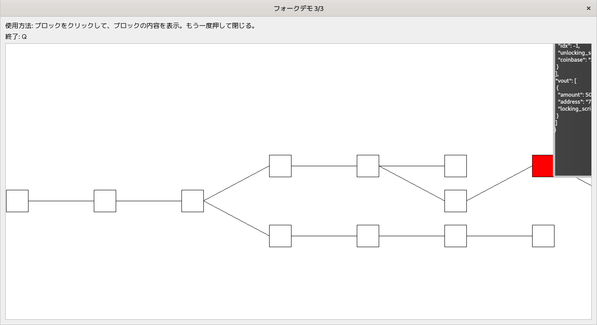
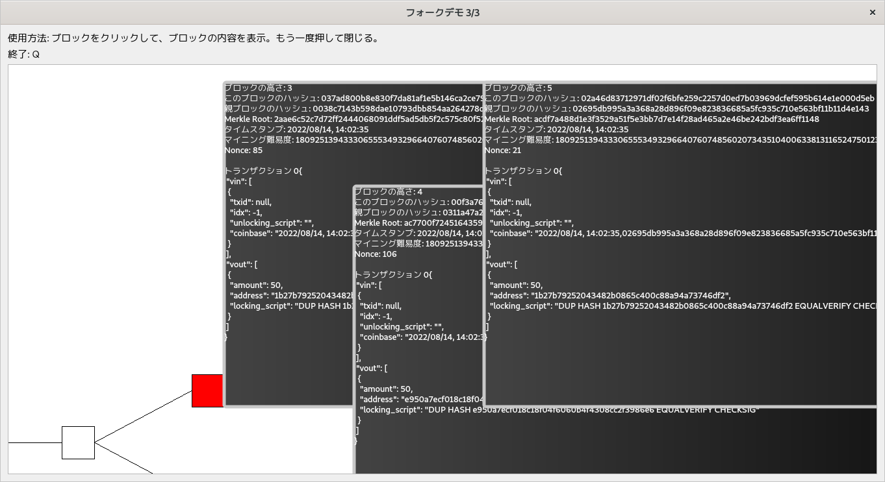

# 手動オフライン暗号通貨デモ

### 必要な外部ライブラリ
* pyqt5(GUIを使用してブロックチェーンを表示したい場合に必要)

### 特徴
* 暗号通貨の基本的な機能を実装
   * トランザクションの生成、受信、デジタル署名生成と検証
   * ブロックの生成、受信、マイニング
   * フォーク発生時のブロックチェーン切り替え処理
   * OrphanトランザクションとOrphanブロックの処理 
* 暗号通貨関連と楕円曲線暗号関連のコードをスクラッチから実装
* 楕円曲線にSecp256k1を使用
* デジタル署名にECDSAを使用
* ネットワーク機能、IPC機能無し
* 手動(例えば、ノードがブロックを受け取りたい場合、receive_blockを呼び出す)

### ディレクトリ
* cryptoディレクトリ内に暗号通貨関連のコードがある
* eccディレクトリ内に楕円曲線暗号関連のコードがある
* guiディレクトリ内にブロックチェーンを視覚的に表示するためのコードがある
* demoディレクトリ内にGUIデモコードがある

### 例1(examples/example1.py)
```python
node1 = Node()
node2 = Node()

block = node1.mine() # node1がマイニングしたブロックを保存
assert node1.get_balance()  == 50,(マイニングしたことでお金を受け取った)

node2.receive_block(block) # node2がブロックを受け取る

# node1からnode2に、10トークン送るトランザクションを生成
tx = node1.create_tx(node2.get_address(),10)

# 今生成したトランザクションを含むブロックをマイニング
block = node1.mine()
assert node1.get_balance() == 90,(50 - 10) + 新たにマイニングした報酬金(50)

node2.receive_block(block) # ブロックを受け取る
assert node2.get_balance() == 10,ブロックがブロックチェーンに追加されたことで所持金が増える
```

### 例2(examples/example2.py)
```python
"""          
	     --|b1| <- |b2| (node1のブロックチェーン)
             |
|Genesis| <- |
             |
             --|b3|        (node2のブロックチェーン)

"""

node1 = Node()
node2 = Node()

# お互いに独立にマイニングしたことで、フォークが発生。
b1  = node1.mine()
b2  = node1.mine()
b3  = node2.mine()

assert node1.get_balance() == 100,(２回マイニングしたため)
assert node2.get_balance() == 50

# node2はb2ブロックを受け取るが、b1(b2の親)を知らないので無視。
node2.receive_block(b2)

# ブロックチェーンが変わらないので、所持金も変わらない
assert node2.get_balance() == 50

# node2がb1ブロックを受け取ったことで、より長いチェーンができる。
# よって、node2はnode1のブロックチェーンに切り替える
node2.receive_block(b1)

# ブロックチェーンを切り替えたため、node2がマイニングしたブロックb3が、ブロックチェーンから外れる。
# よって、b3のコインベーストランザクションも無効化されたことで、所持金が0になる。
assert node2.get_balance() == 0
assert node1.get_balance() == 100,node1のブロックチェーンは一切変わらないので、所持金も変わらない。
```


### 例3(examples/example3.py)
```python
node1 = Node()	
node2 = Node()
    
block = node1.mine()
node2.receive_block(block)

# 新たなノードがネットワークに参加
alice = Node()
bob   = Node()

# aliceとbobはそれぞれnode1、node2のブロックチェーンと同期(ブロックをダウンロード)
alice.sync_with(node1)
bob.sync_with(node2)

# node1がaliceにお金を送信
tx = node1.create_tx(alice.get_address(),20)

# node2がトランザクションを受け取る
node2.receive_tx(tx)

# node2が今受け取ったトランザクションを含むブロックをマイニング
block = node2.mine()

# 各々のノードがブロックを受信
node1.receive_block(block)
alice.receive_block(block)
bob.receive_block(block)

assert alice.get_balance() == 20 # aliceの所持金

# aliceが以下のトランザクションを生成
tx1 = alice.create_tx(bob.get_address(),7) # bobに7トークン送る
tx2 = alice.create_tx(bob.get_address(),3) # 再度bobに3トークン送る
tx3 = alice.create_tx("some address",10)   # 適当なアドレスに10トークン送る(トークンを捨てる)
    
assert alice.get_balance() == 0 # 所持金を使い切った

# node1がトランザクションを受け取る
node1.receive_tx(tx1)
node1.receive_tx(tx2)
node1.receive_tx(tx3)

# node1が今受け取ったトランザクションを含むブロックをマイニング
block = node1.mine()
    
# bobがブロックを受け取る
bob.receive_block(block)

assert bob.get_balance() == 10 # ブロックを受け取ったことで所持金が増える
    
# bobのブロックチェーンをGUIを使用して表示
show(bob)
```

### テスト
```sh
python3 -m unittest
```

### GUIデモ(ブロックチェーンを視覚的に表示)
```sh
cd demo
python3 demo.py
```

### GUIデモ画像



### 参考文献
* Mastering Bitcoin,2nd Edition,by Andreas M. Antonopoulos