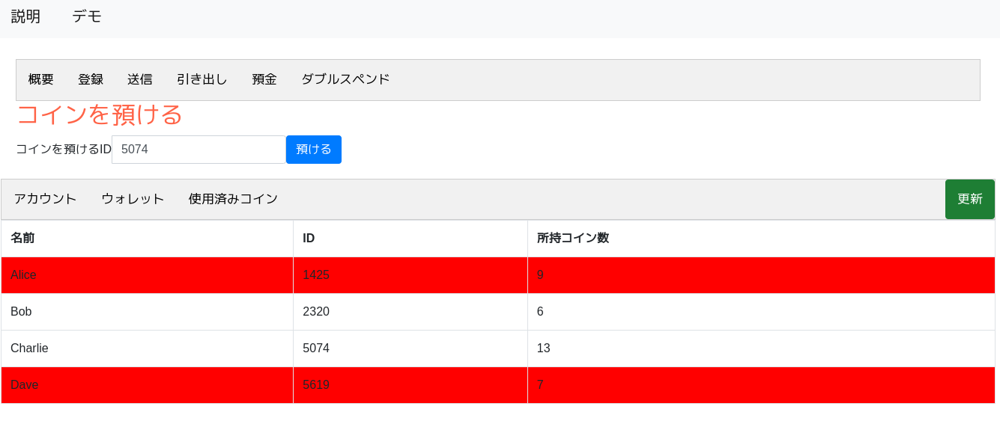
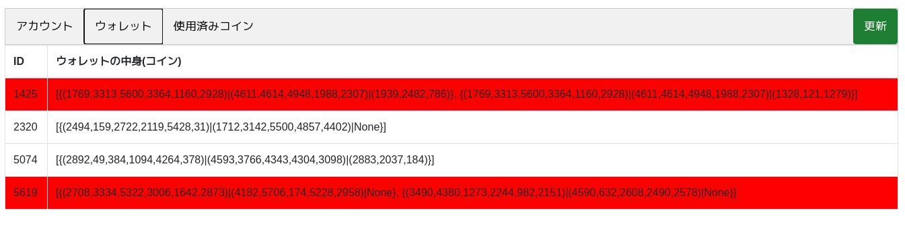
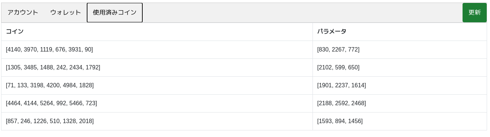

# デジタルキャッシュ デモ

### 必要な外部ライブラリ
* sqlite3(python3)
* flask(python3)
* sympy(python3)

### 説明
* デジタルキャッシュデモ
* デモのWebページに使用方法と理論的な説明あり

### デモ
```bash
cd app
python3 app.py
# ブラウザーを開いて、URL"http://127.0.0.1:5000"にアクセス
```

### デモ画像




### 参考文献
* Introduction to Cryptography with Coding Theory,2nd Edition