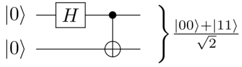
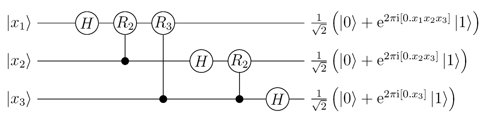

# ノイズレス簡易量子コンピューティングデモ

### 必要なライブラリ
* numpy

## 出来ること(examples/):
* 量子フーリエ変換
* 量子テレポーテーション
* Superdense coding
* Deutschのアルゴリズム

### Bell基底をつくる例(examples/bell_basis.py)

```python
from quantum.qubit import Qubit
from quantum.operator import *

x1 = Qubit.zero() # |0>
print(x1) # ((1+0j))|0> + (0j)|1>

x2 = Qubit.zero() # |0>
print(x2) # ((1+0j))|0> + (0j)|1>

x = Qubit.entangle(x1,x2) # |00>
print(x) # ((1+0j))|00> + (0j)|01> + (0j)|10> + (0j)|11>

x.single_qubit_gate(hadamard(),1) # x1にアダマールゲートを作用。
x.two_qubits_gate(pauli_x(),1,2) # x1,x2にCnot(pauli_x)ゲートを作用。

print(x) #((0.7071067811865476+0j))|00> + (0j)|01> + (0j)|10> + ((0.7071067811865476+0j))|11>
```

### 量子フーリエ変換の例(examples/quantum_fourier_transform.py)

```python
from quantum.qubit import Qubit
from quantum.operator import *

x1 = Qubit.one()   # |1>
x2 = Qubit.zero()  # |0>
x3 = Qubit.zero()  # |0>
x = Qubit.entangle(x1,x2,x3) # |100>

x.single_qubit_gate(hadamard(),1)
x.two_qubits_gate(controlled_phase(2),2,1)
x.two_qubits_gate(controlled_phase(3),3,1)
 
x.single_qubit_gate(hadamard(),2)
x.two_qubits_gate(controlled_phase(2),3,2)

x.single_qubit_gate(hadamard(),3)

# SwapゲートをCnotゲートで代用。
x.two_qubits_gate(pauli_x(),1,3)
x.two_qubits_gate(pauli_x(),3,1)
x.two_qubits_gate(pauli_x(),1,3)

# ((0.35355339059327384+0j))|000> + ((-0.35355339059327384+0j))|001> + ((0.35355339059327384+0j))|010> + ((-0.35355339059327384+0j))|011> +
# ((0.35355339059327384+0j))|100> + ((-0.35355339059327384+0j))|101> + ((0.35355339059327384+0j))|110> + ((-0.35355339059327384+0j))|111>
print(x)
```

### テスト
```bash
python3 -m unittest
```

### 参考文献
* https://arxiv.org/pdf/1601.07195.pdf
* Quantum Computing: An Applied Approach,Jack D. Hidary