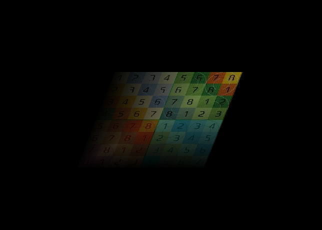
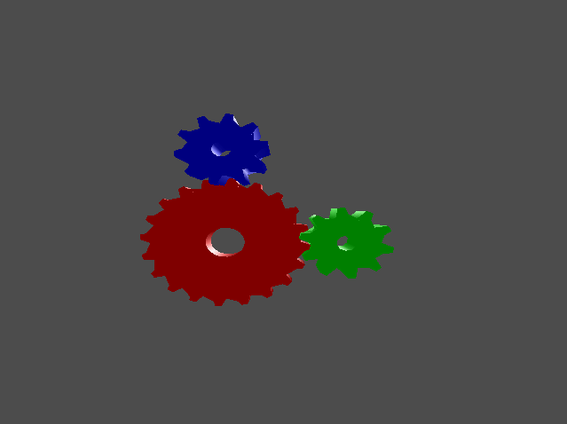

# 簡易ソフトウェアレンダラー

### 必要な外部ライブラリ
* Xlib(ピクセル描写に必要)
* CImg(デモ内で、テクスチャ画像を読み込む際に必要)
* gtest(ユニットテストを行う際に必要)

### 使用アルゴリズム
* Blinn-Phong reflection modelとGouraud shading modelを使用(他のモデルは使用不可)
* Sutherland–Hodgman クリッピングアルゴリズムを使用

### 特徴
* Fixed-function パイプライン
* 24ビットカラーのみに対応
* リトルエンディアンCPUのみ対応
* 32bit Intel CPU,Debian GNU/Linux 11 (bullseye) 32-bit上でのみ動作確認済み
* 実用的でない(遅い)
* アンチエイリアスなし
* 直線描写不可
* Orthographic Projectionサポートなし(つまり,Perspective Projectionのみ)
* ウィンドウリサイズ不可
* Point Lightのみサポート
* Texture Wrapping Modeはリピートのみサポート(OpenGLにおいて、GL_REPEATに相当)

### デモ
```bash
> cd ./examples
> mkdir build && cd build
> cmake ..
> make
```

### 色付き三角形デモ(/examples/triangle.cpp)


### テクスチャマッピングデモ(/examples/plane.cpp)


### シェルピンスキーの三角形デモ(/examples/sierpinski.cpp)


### 複数光源デモ(/examples/light.cpp)


### glxgears風デモ(/examples/gear.cpp)


### 太陽系(太陽と地球のみ)デモ(/examples/sun_earth.cpp)


### 簡易シューティングデモ(/examples/shooter.cpp)


### 参考文献
* Fundamentals of Computer Graphics,4th Edition,by Steve Marschner, Peter Shirley