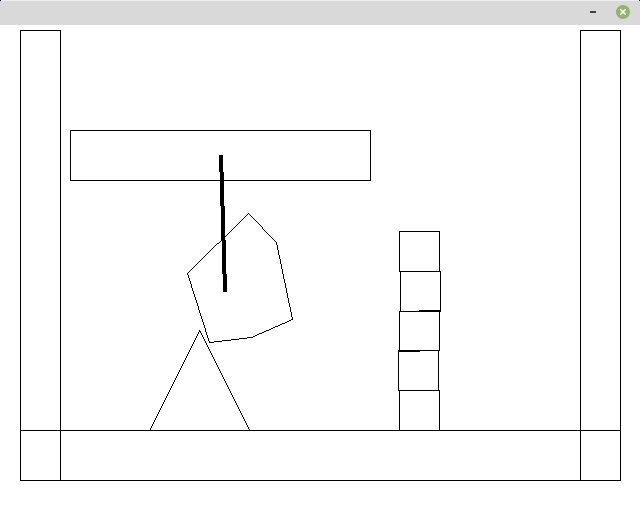
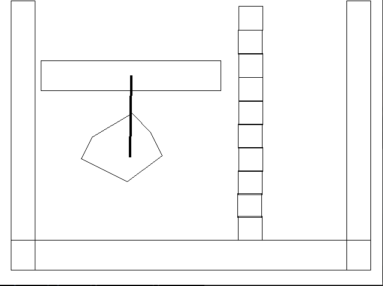

# 簡易2D物理シュミレーションデモ

### 必要な外部ライブラリ
* pygame

### 使用アルゴリズム
* 衝突判定にGJK(Gilbert–Johnson–Keerthi)アルゴリズムを使用
* Contactデータ生成にEPA(Expanding Polytope Algorithm)を使用
* Collision ResponseにSequential Impulse Solverを使用

### デモ
``` bash
cd ./demos

# /physics/params.py内に調節可能なパラメータがある
python3 demo1.py
python3 demo2.py
```

### サンプル画像


### サンプルGIF


# 参考文献
* Gino van den Bergen. Collision Detection in Interactive 3D Environments
* Ian Millington. Game Physics Engine Development
* Erin Catto. Fast and Simple Physics using Sequential Impulses
  (https://box2d.org/files/ErinCatto_SequentialImpulses_GDC2006.pdf)